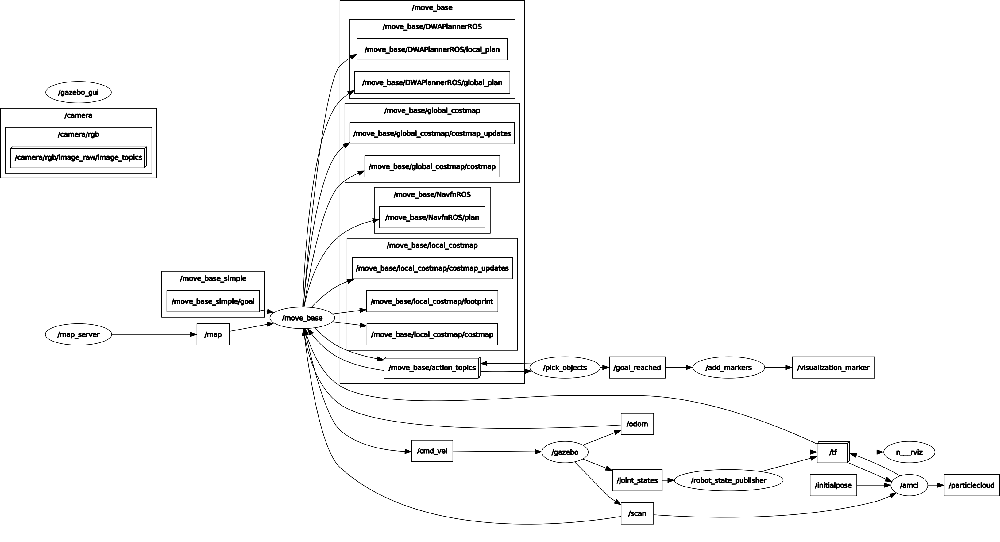

# Home Service Robot
The aim of the project is to program a robot than can autonomously go to pick up zone to take virtual object and go to drop off zone to leave that object.

<p align="center">
  
  <br>Robot is navigating autonomously
</p>

## Installations
```bash
sudo apt-get install ros-melodic-turtlebot3*
sudo apt-get install ros-melodic-slam*
sudo apt-get install ros-melodic-navigation
```

## Packages
* `service_robot`: Which includes turtlebot3 launch files, 2D map and rviz configuration.
* `pick_objects`: Which interacts with move_base action server/client.
* `add_markers`: Which creates visualization marker.

## Nodes
* `map_server`: Which publishes **/map** topic.
* `move_base`: Which subscribes to **/map**, **/tf**, **/scan**, **/odom** topic and publishes **/cmd_vel** topic. 
* `amcl`: Which subscribes to **/scan** topic and publishes **/tf** topic.
* `pick_objects`: Which subscribes to **/move_base/action_topics** topic and publishes **/goal_reached** topic.
* `add_markers`: Which subscribes to **/goal_reached** topic and publishes **/visualization_marker** topic.

<p align="center">
  
  <br>Rosgraph of the project
</p>

## How to use
Configure turtlebot3 model in .bashrc file
```bash
export TURTLEBOT3_MODEL=waffle
```

For start robot
```bash
sh RoboND_P5_Home_Service_Robot/src/service_robot/scripts/home_service.sh
```